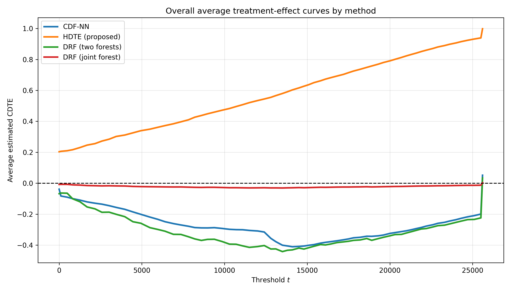
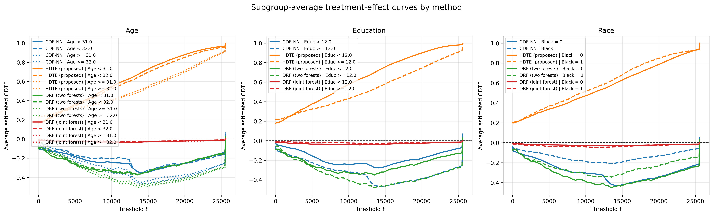
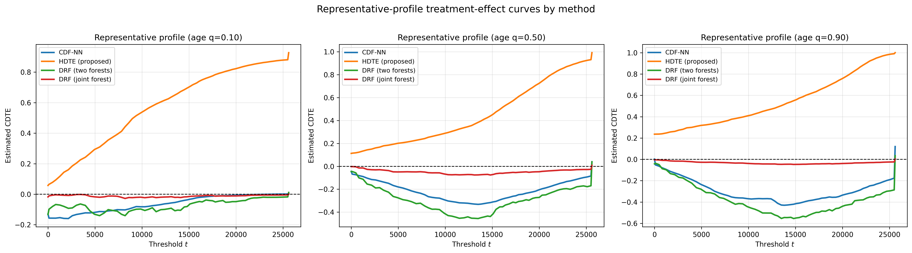

# Additional Results for HDTE-NN

This repository contains additional visualizations supporting the interpretability analysis of the proposed HDTE-NN estimator.  
All results are averaged over 100 repeated sample splits.

---

# Dataset 1: NHANES

## Interpretability of estimated treatment effects

To complement the score-based evaluation, we provide visual summaries of the estimated conditional distributional treatment effects.

---

## 1. Overall average treatment-effect curves

The overall average estimated treatment-effect curve exhibits a clear and systematic transition for HDTE-NN from slightly negative values at lower thresholds to positive values at moderate and large thresholds.  
This indicates a structured shift in the BMI distribution associated with school-meal participation.

In particular, positive values at higher thresholds correspond to an increased probability of being below larger BMI cutoffs, consistent with a reduction in the upper tail of the BMI distribution.

By contrast, CDF-NN and both DRF variants remain close to zero over most thresholds, indicating substantially weaker detected effects.  
The DRF two-forest implementation exhibits noticeable oscillations, while CDF-NN and the joint DRF estimator produce flatter curves with limited variation.

Overall, HDTE-NN captures a stronger, smoother, and more coherent distributional signal.

---

## 2. Subgroup-average treatment-effect curves

Subgroup-average curves reveal clear heterogeneity across covariates:

- **Age:** Older children exhibit larger positive effects at moderate and high thresholds, while younger groups show weaker effects.
- **Child sex:** HDTE-NN yields clearer separation between groups, whereas competing methods remain close to zero.
- **Income:** The strongest contrast appears across income groups, where HDTE-NN reveals sharply distinct patterns, including opposite-sign effects at higher thresholds.

By contrast, CDF-NN and DRF variants remain near zero and fail to capture this heterogeneity.

Overall, HDTE-NN provides a more expressive and stable characterization of treatment-effect heterogeneity.

---

## 3. Representative-profile treatment-effect curves

Representative profiles further illustrate the flexibility of HDTE-NN:

- **Young profile (q = 0.10):** Strong positive and increasing curve.
- **Median profile (q = 0.50):** Clear negative curve with increasing magnitude.
- **Older profile (q = 0.90):** Even more pronounced negative curve.

By contrast, competing methods produce flatter or less structured curves, with DRF (joint) remaining particularly close to zero.

These results highlight substantial heterogeneity in both magnitude and direction across profiles.

---

## Summary (NHANES)

HDTE-NN:
- captures structured variation across thresholds,
- reveals clear heterogeneity across subpopulations,
- produces smooth and profile-specific treatment-effect curves.

Competing methods tend to attenuate effects toward zero or produce less coherent patterns.

---

# Dataset 2: CPS / NSW

## Interpretability of estimated treatment effects

To complement the score-based evaluation, we provide visual summaries of the estimated conditional distributional treatment effects.

---

## 1. Overall average treatment-effect curves

The overall average treatment-effect curve is positive and approximately monotone increasing across the threshold range, indicating a systematic distributional shift associated with the NSW program.

The effect becomes larger at higher thresholds, suggesting stronger impacts at moderate and high earnings levels.

By contrast, CDF-NN and DRF (two forests) are negative over most thresholds, while DRF (joint) remains close to zero.

Overall, HDTE-NN captures a substantially stronger and more structured positive distributional effect.

---

## 2. Subgroup-average treatment-effect curves

Subgroup-average curves reveal meaningful heterogeneity:

- **Education:** Individuals with at least 12 years of education exhibit larger effects, especially at moderate and high thresholds.
- **Race:** Effects are larger for the Black subgroup across nearly the entire threshold range.
- **Age:** Differences are more modest, with some indication of larger effects for older groups at higher thresholds.

Across all panels, HDTE-NN produces positive and increasing curves, while competing methods remain negative or near zero.

---

## 3. Representative-profile treatment-effect curves

Representative profiles illustrate variation across individuals:

- **Young profile (q = 0.10):** Smaller positive effects.
- **Median profile (q = 0.50):** Larger effects across most thresholds.
- **Older profile (q = 0.90):** Also strong effects, comparable to the median profile.

Competing methods remain negative or close to zero.

---

## 4. Relation to prior work

These findings are consistent with prior analyses of the CPS-augmented NSW dataset (LaLonde, 1986; Dehejia and Wahba, 1999, 2002), which report positive average treatment effects.

They also align with the causal fused lasso (CFL2) estimator, which finds a constant positive effect with little to no heterogeneity at the level of conditional means.

Similarly, Abadie et al. (2018) report small positive effects with limited subgroup variation.

HDTE-NN agrees at an aggregate level but reveals additional structure:  
treatment effects vary systematically across thresholds and covariate profiles, indicating heterogeneity not captured by mean-based methods.

---

## Summary (CPS / NSW)

HDTE-NN:
- detects consistent positive effects,
- reveals distributional heterogeneity,
- captures variation across thresholds and profiles.

Competing methods tend to produce flatter or near-zero estimates.

---

## References

- Chan, K. C. G., Yam, S. C. P., & Zhang, Z. (2016).  
  *Globally efficient non-parametric inference of average treatment effects*.  
  Journal of the Royal Statistical Society: Series B, 78(3):673–700.

- Padilla, O. H. M., Chen, Y., Padilla, C. M. M., & Ruiz, G. (2026).  
  *A causal fused lasso for interpretable heterogeneous treatment effects estimation*.  
  Journal of Machine Learning Research, 27(40):1–56.

- Abadie, A., Chingos, M. M., & West, M. R. (2018).  
  *Endogenous stratification in randomized experiments*.  
  Review of Economics and Statistics, 100(4):567–580.

- LaLonde, R. J. (1986).  
  *Evaluating the econometric evaluations of training programs with experimental data*.  
  The American Economic Review, 76(4):604–620.

- Dehejia, R. H., & Wahba, S. (1999).  
  *Causal effects in nonexperimental studies: Reevaluating the evaluation of training programs*.  
  Journal of the American Statistical Association, 94(448):1053–1062.

- Dehejia, R. H., & Wahba, S. (2002).  
  *Propensity score-matching methods for nonexperimental causal studies*.  
  Review of Economics and Statistics, 84(1):151–161.

---

## Note

This repository is provided for anonymous review purposes only.
