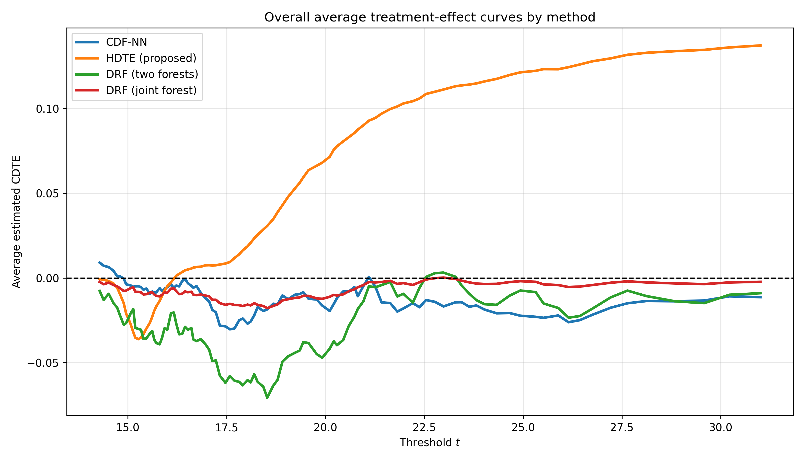
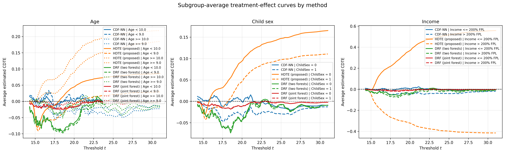
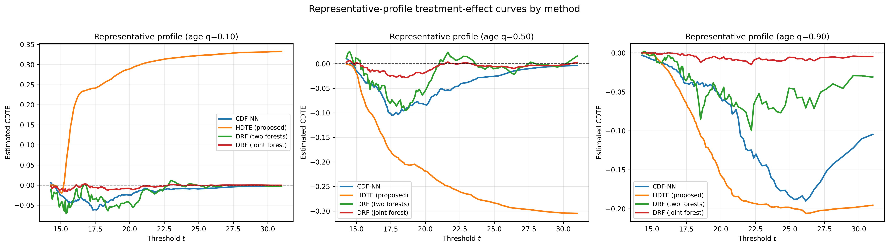

# Additional Results for HDTE-NN

This repository contains additional visualizations supporting the interpretability analysis of the proposed HDTE-NN estimator on the NHANES dataset (see Appendix A.1 of the paper).  
All results are averaged over 100 repeated sample splits.

---

## Interpretability of estimated treatment effects

To complement the score-based evaluation, we provide visual summaries of the estimated conditional distributional treatment effects.

---

## 1. Overall average treatment-effect curves

The overall average estimated treatment-effect curve (see *plot5_practical_overall_curves.png*) shows a clear and systematic transition for HDTE-NN from slightly negative values at lower thresholds to positive values at moderate and large thresholds.  
This indicates a structured shift in the BMI distribution associated with school-meal participation.

In particular, positive values at higher thresholds suggest an increased probability of being below larger BMI cutoffs, consistent with a reduction in the upper tail of the BMI distribution.

By contrast, CDF-NN and both DRF variants remain close to zero over most thresholds, indicating substantially weaker detected effects.  
The DRF two-forest implementation exhibits noticeable oscillations, while CDF-NN and joint DRF produce flatter curves with limited variation.

Overall, HDTE-NN captures a stronger, smoother, and more coherent distributional signal.

---

## 2. Subgroup-average treatment-effect curves

Subgroup-average curves (see *plot6_practical_subgroup_curves.png*) reveal clear heterogeneity across covariates:

- **Age:** HDTE-NN produces well-separated curves across age groups, with older children exhibiting larger positive effects at moderate and high thresholds. Competing methods remain flatter and less differentiated.
- **Child sex:** HDTE-NN shows clear separation between groups, whereas competing methods stay close to zero with limited differences.
- **Income:** The strongest contrast appears here. HDTE-NN reveals sharply distinct patterns, including opposite-sign effects at higher thresholds across income groups. In contrast, CDF-NN and DRF remain near zero and fail to capture this heterogeneity.

Overall, HDTE-NN provides a more expressive and stable characterization of treatment-effect heterogeneity.

---

## 3. Representative-profile treatment-effect curves

Representative profiles (see *plot7_practical_representative_profiles.png*) further illustrate the flexibility of HDTE-NN:

- **Young profile (q=0.10):** HDTE-NN produces a strongly positive and smooth curve, while competing methods remain near zero or slightly negative.
- **Median profile (q=0.50):** HDTE-NN yields a clearly negative curve whose magnitude increases with the threshold, indicating a structured shift differing from the younger group.
- **Older profile (q=0.90):** HDTE-NN produces an even more pronounced negative curve, with larger magnitude than the median profile.

By contrast, competing methods produce flatter or less structured curves, with DRF (joint) remaining particularly close to zero.

---

## Summary

These results show that HDTE-NN:
- captures structured variation across thresholds,
- reveals clear heterogeneity across subpopulations,
- produces smooth and profile-specific treatment-effect curves.

In contrast, competing methods tend to attenuate effects toward zero or produce less coherent patterns, limiting interpretability.

---

## Note

This repository is provided for anonymous review purposes only.
